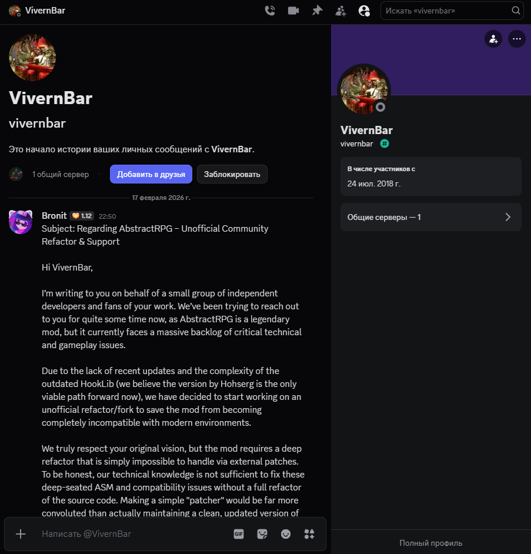

# AbstractRPG: Community Edition

## Why this fork exists

The community has been unable to reach the original author (VivernBar) for a long time. To prevent this legendary mod from becoming obsolete and incompatible with modern environments, we have decided to launch this unofficial community-maintained version.

- **Non-profit**: We are not seeking any profit. This mod will never be monetized; we consider it a part of the community's heritage.
- **Goal**: Our sole mission is to keep the mod afloat, fix the massive backlog of technical issues, and ensure it doesn't fade into obscurity.
- **Issues**: A vast number of bugs and compatibility conflicts are already known, and many more will likely surface.

**How to support us**: The best way to help is to report bugs in the "Issues" tab.

## Status & Downloads

- **Stable Releases**: Once a stable version is ready, it will be published in the Releases tab.
- **Experimental**: Currently, you can use builds from GitHub Actions, but do so at your own risk.

## Proof of Inactivity

We have verified that VivernBar has been inactive since December 2024:

- [YouTube](https://www.youtube.com/@vivernbar): The last video was published on Dec 9, 2024.
- [Discord](https://discord.gg/ucdCkGRrRa): The last message on the official server was sent on Dec 9, 2024.
- [CurseForge](https://www.curseforge.com/minecraft/mc-mods/abstract-rpg): The last official update was released on Dec 7, 2024.

I have personally reached out to the author on every possible platform (Discord, CurseForge, etc.) requesting contact.
  
*My primary language is Russian, so you might see it in screenshots and some parts of the project. I apologize to the English-speaking audience (who make up the majority) for this, but I'll be honest — I was too lazy to change my entire interface just for the sake of screenshots.*

## Contact

I am always open to questions, suggestions, or claims. If the original OWNER wishes to resume development or has any objections, please contact me immediately.

# TEMPORARILY only in Russian

## Это мой неофициальный форк AbstractRPG от VivernBar  

Почему я решил сделать форк и что я планирую сделать
 
- В первую очередь моя цель - починить множественные проблемы мода. Если вам известны какие-либо баги/краши и т.п. - создайте issue на этом репозитории (желательно на русском или английском)
- Доработать всё то в моде, что сейчас есть, но не имеет полный функционал (при том условии, что этот функционал подразумевается)
- Реорганизовать мод, чтобы его исходный код можно было свободно читать (сейчас там, мягко говоря, дебри)

Я не планирую добавлять кастомный контент в свой форк. Все изменения будут связаны исключительно с технической частью.

P.s. возможно я откажусь от HookLib и перейду на MixinBooter, но пока не решил.

## Скачать актуальную версию можно во вкладке Actions. Скачивайте только те версии, которые успешно прошли тест сервера!
